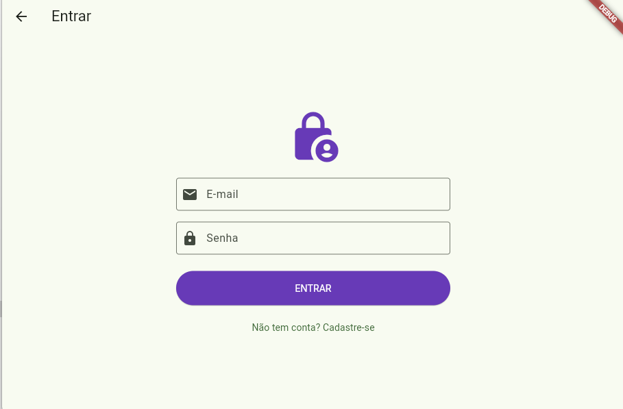
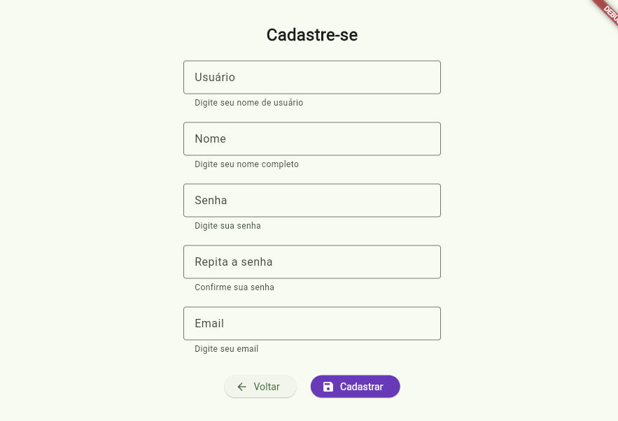

# 📝 TaskList - Estudo de Flutter & Firebase

O **TaskList** é um ecossistema de aprendizado focado na construção de aplicações modernas com Flutter. O projeto evoluiu de um gerador de palavras simples para uma aplicação robusta com **autenticação real (Firebase)** e persistência em banco de dados **NoSQL (Firestore)**.

---

## 📸 Screenshots (Módulo de Acesso)

| Tela de Cadastro | Validação de Erros |
|:---:|:---:|
|  |  |

---

## 🚀 Funcionalidades Atuais

- [x] **Autenticação com Firebase:** Registro e Login seguro de usuários.
- [x] **Banco de Dados Real:** Integração com Cloud Firestore.
- [x] **Gerenciamento de Estado:** Uso do `Provider`.
- [x] **Interface Responsiva:** Uso de `NavigationRail`.

---

## 🧠 Aprendizados Chave

Durante o desenvolvimento, foram aplicados conceitos fundamentais de engenharia de software:

* **Async Gaps:** Implementação de `if (!mounted) return;` para evitar erros de contexto em chamadas assíncronas.
* **Tratamento de Exceções:** Captura de erros de backend (Firebase) e tradução para mensagens amigáveis.
* **Web Layout:** Ajuste de constraints de largura (`BoxConstraints`) para garantir boa usabilidade.

---

## 🔧 Como rodar o projeto

Durante o desenvolvimento, foram aplicados conceitos fundamentais de engenharia de software:

* **Instale as dependências:** No terminal, execute: flutter pub get

* **Execute a aplicação:** No terminal, execute: flutter run -d chrome

---

## 🏗 Estrutura do Projeto

```bash
lib/
├─ app/           # Estado (Provider)
├─ pages/         # Telas (Login, Cadastro, etc)
├─ widgets/       # Componentes reutilizáveis
└─ main.dart      # Inicialização

